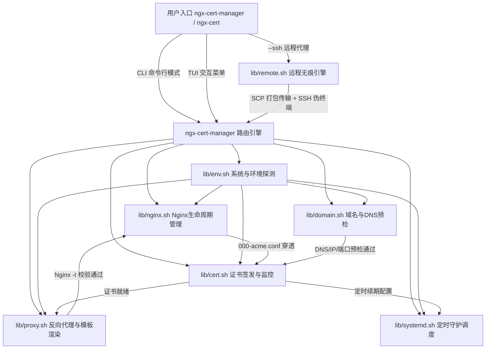

# ngx-cert-manager (Nginx & Let's Encrypt 一体化运维管理套件)

[](LICENSE)
[]()
[-orange.svg)]()
[]()
[]()

> **ngx-cert-manager** 是专为 Linux 生产服务器设计的轻量级、模块化 Shell 运维管理套件与系统级 CLI 工具。  
> 支持 **TUI 交互式大盘控制台** 与 **标准 CLI 命令行接口**，提供从 Nginx 适配、DNS 防限流预检、Let's Encrypt 零停机证书签发与续期，到现代安全反向代理配置生成、Debian/APT 打包及远程 SSH 免安装代理部署的全流程闭环。

---

## 🌟 核心特性与架构设计



### 1. 🛡️ 故障防御与自愈矩阵
* **IPv6 动态嗅探防崩溃**：对无 IPv6 内核或未分配公网 IPv6 的容器环境，自动剔除 `[::]` 监听指令，彻底根除 Nginx `[emerg] (97: Address family not supported by protocol)` 致命启动崩溃。
* **DNS 预检与防限流爆破**：多源公网 IP 嗅探 + DNS 实时核对，解析未生效前严格阻断并支持交互式轮询等待，杜绝 Let's Encrypt 触发每小时 5 次限流惩罚。
* **Cloudflare CDN 智能识别**：自动识别 Cloudflare 小黄云代理状态，给出 SSL 模式配置引导。
* **80 端口冲突自愈**：智能扫描占用 80 端口的非 Nginx 进程（如 Apache2 / Caddy / Node），提供一键停用与端口释放。
* **配置事务机制与原子回滚**：新配置生成遵循「快照备份 -> `.tmp` 预写入 -> `nginx -t` 测试 -> 成功原子替换 / 失败秒级还原」，保障已有线上业务零停机、零故障。
* **Nginx 版本自适应 HTTP/2**：Nginx >= 1.25.1 自动采用现代 `http2 on;` 语法，旧版本自动兼容 `listen 443 ssl http2;`，杜绝废弃指令 warning。
* **续期定时器随机抖动**：Systemd Timer 默认配置 `RandomizedDelaySec=3600`，打散续期时间窗口，避免并发冲击 CA。
* **SSH 远程无痕执行**：`--ssh user@host` 本地动态打包并透传至远端伪终端，会话断开后通过 `trap` 彻底销毁临时文件，即用即走。

---

## 📊 业界主流方案对比

| 维度 | Certbot 官方 CLI | Nginx Proxy Manager (NPM) | acme.sh 纯脚本 | **ngx-cert-manager** (本项目) |
| :--- | :--- | :--- | :--- | :--- |
| **运行时依赖** | 依赖 Python/Snap，占用较大 | 依赖 Docker/MySQL/NodeJS/Web 端口 | 纯 Shell，极轻量 | **纯 Shell，极轻量，零冗余服务** |
| **安装分发方式** | Snap / Pip / Apt | Docker Compose | curl 脚本 | **Git 零依赖 / 一键安装 / Debian APT (.deb)** |
| **Nginx 反代管理** | 仅做注入修改，易改坏原有配置 | Web UI 统一管理，黑盒存储 | 需自行手动写 Nginx 配置 | **内置现代化反代生产模板，原子化管理** |
| **DNS 与防爆破预检** | 无，解析错误直接请求导致限流 | 基础检验 | 基础检验 | **多源公网IP核对 + DNS轮询 + 80端口自愈** |
| **运维侵入性** | 修改现有 conf 文件 | 强接管所有 Nginx 流量 | 仅负责证书产物输出 | **统一 `/etc/nginx/conf.d/` 隔离管理，支持原子回滚** |
| **多机远程部署** | 需在每台机器登录安装 | 需每台机器装 Agent/Docker | 需单独登录配置 | **原生 `--ssh` 远程无痕代理执行，即用即走** |
| **调度守护机制** | Systemd Timer / Cron | 内部调度器 | Crontab | **Systemd Timer (随机延迟) + Cron 自动降级** |

---

## 🚀 安装与分发方式

本项目支持三种安装与运行模式：

### 方式 1: 本地源码即用模式 (无需安装)
```bash
git clone https://github.com/xzsean666/Auto-Certificate.git
cd Auto-Certificate
sudo ./ngx-cert-manager
```

### 方式 2: 系统级一键安装 (`make install` / `install.sh`)
```bash
git clone https://github.com/xzsean666/Auto-Certificate.git
cd Auto-Certificate
sudo make install

# 安装后，可在系统任意位置直接调用命令：
sudo ngx-cert-manager
# 或简短别名：
sudo ngx-cert site list
```
*卸载只需运行：`sudo make uninstall`*

### 方式 3: Debian / Ubuntu 软件包安装 (`.deb` / APT)
```bash
# 1. 一键构建 .deb 安装包
make deb

# 2. 安装生成的软件包
sudo dpkg -i dist/ngx-cert-manager_1.0.0_all.deb
sudo apt-get install -f  # 自动补齐基础依赖

# 3. 安装完成后全局可用
ngx-cert-manager --help
```

---

## 💻 CLI 命令行使用指南 (CI/CD / 脚本友好)

> 📖 **完整命令参数与高级场景手册**：详见 [**`docs/CLI_REFERENCE.md`**](file:///home/sean/git/Auto-Certificate/docs/CLI_REFERENCE.md)

### 1. 反向代理站点管理 (`site`)

```bash
# 一键验证域名 + 申请证书 + 生成生产级反向代理 (支持 WebSocket 与 HSTS)
sudo ngx-cert-manager site add \
  --domain api.example.com \
  --upstream 127.0.0.1:3000 \
  --email admin@example.com \
  --hsts \
  --ws

# 查看所有已配置站点列表与状态 (亦可使用短别名 ngx-cert)
sudo ngx-cert site list

# 查看指定站点的 Nginx 配置文件
sudo ngx-cert site get --domain api.example.com

# 删除站点 (可选同时吊销证书)
sudo ngx-cert site delete --domain api.example.com --delete-cert
```

### 2. 证书生命周期管理 (`cert`)

```bash
# 申请证书 (默认 Webroot 零停机模式)
sudo ngx-cert cert issue --domain example.com --email admin@example.com

# 使用 Staging 沙箱测试环境演练签发 (不消耗正式限额)
sudo ngx-cert cert issue --domain example.com --email admin@example.com --staging

# 查看所有受管证书大盘、剩余有效天数与 🟢/🟡/🔴 三级预警
sudo ngx-cert cert list

# 自动化续期扫描与模拟测试
sudo ngx-cert cert renew --dry-run
sudo ngx-cert cert renew --force

# 吊销证书
sudo ngx-cert cert revoke --domain example.com
```

### 3. Nginx 运维控制 (`nginx`)

```bash
# 查看 Nginx 运行状态与安装信息
sudo ngx-cert nginx status

# 语法安全自检与平滑重载
sudo ngx-cert nginx test
sudo ngx-cert nginx reload

# 初始化全局 ACME 穿透与 WebSocket Map
sudo ngx-cert nginx bootstrap
```

### 4. 自动化续期守护 (`timer`)

```bash
# 注册并启用自动续期定时器 (Systemd Timer / Cron 自适应)
sudo ngx-cert timer setup

# 查看定时任务状态与下次触发时间
sudo ngx-cert timer status

# 立即触发一次测试续期
sudo ngx-cert timer trigger

# 查看自动续期审计日志
sudo ngx-cert timer logs
```

### 5. 系统全面体检 (`diagnose`)

```bash
sudo ngx-cert diagnose
```

### 6. 远程 SSH 无痕免安装运维 (`--ssh`)

```bash
# 本地控制远端机器，无需在远端提前安装任何套件：
ngx-cert-manager --ssh root@203.0.113.10 site list
ngx-cert-manager --ssh root@203.0.113.10 site add --domain api.remote.com --upstream 127.0.0.1:8080
```

---

## 📚 场景实战与进阶文档 (Documentation)

针对各种不同的网络拓扑与业务场景，我们提供了详尽的专项目录指南：

* 📘 **[全场景实战与配置全集指南](docs/FULL_SCENARIOS_GUIDE.md)**：包含全拓扑选型决策树、公网 VPS 直连、Cloudflare 小黄云 Proxied 边缘 CDN、纯 DNS 直连等全场景方案与完整命令。
* 📙 **[内网穿透与泛域名反代实战指南](docs/INTRANET_FRP_WILDCARD_GUIDE.md)**：针对无公网 IP、FRP 单端口（如 `26703`）复用、Cloudflare DNS-01 泛域名证书（`*.domain.com`）与持续新增内网子域名的完整实战手册。
* 📕 **[CLI 完整命令字典与参数参考](docs/CLI_REFERENCE.md)**：所有子命令、可选参数、环境变量与技术原理解析。
* 📋 **[即拷即用实战命令清单](cmd_examples)**：整理好的高频运维场景一键单行命令集。

---

## 🖥️ 交互式 TUI 大盘预览

```text
================================================================================
              Nginx & SSL 自动化运维管理套件 v1.0.0
   服务器 IP: 203.0.113.15 | 系统环境: Ubuntu 22.04 LTS (x86_64)
================================================================================
【Nginx 状态】: 已安装 (1.24.0) | 进程: 运行中
【自动 续期】: [ 守护中 ] (Systemd Timer: certbot-renew.timer 已激活)
--------------------------------------------------------------------------------
 1. [一键向导] 域名预检 + 签发证书 + 配置 SSL 反代 (零停机)
 2. [站点管理] 查看所有代理站点 / 新增 / 查看配置 / 删除站点
 3. [证书中心] 证书列表大盘 / 手动签发 / 强制续期 / 吊销证书
 4. [Nginx运维] 安装或检测 / 语法校验 / 平滑重载 / 启停控制 / 全局规则注入
 5. [定时守护] 注册续期定时器 / 查看守护状态 / 立即触发测试 / 查看审计日志
 6. [系统体检] 网络 IP 嗅探 / IPv6 支持分析 / 80 端口占用排查 / 综合体检
 0. 退出管理套件
================================================================================"
```

---

## 🌐 支持的操作系统与兼容性

| 发行版分支 | 适配操作系统 | 包管理器 | 守护体系 |
| :--- | :--- | :--- | :--- |
| **Debian 系列** | Ubuntu 18.04+, Debian 10+, Linux Mint, Kali | `apt-get` / `.deb` | Systemd / Cron |
| **RHEL 系列** | CentOS 7/8/9, RHEL, Rocky Linux, AlmaLinux, Fedora | `dnf` / `yum` | Systemd / Cron |
| **Alpine 系列** | Alpine Linux 3.x (容器与极简环境) | `apk` | OpenRC / Cron |
| **Arch 系列** | Arch Linux, Manjaro | `pacman` | Systemd |

---

## 🧪 自动化测试与打包

运行全套单元测试与端到端 (E2E) 集成测试：

```bash
make test
```

运行代码静态分析与语法检查：

```bash
make lint
```

构建 Debian 安装包：

```bash
make deb
```

---

## 📄 开源许可证

本项目基于 [MIT License](LICENSE) 开源。
