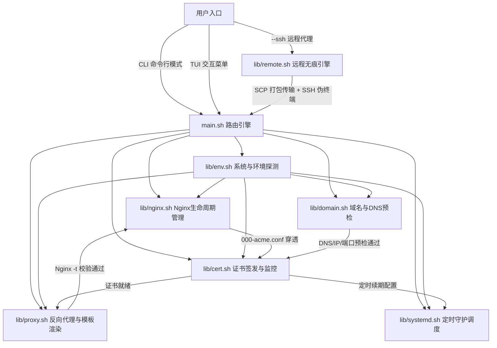

# Nginx & Let's Encrypt 一体化运维管理套件 (ngx-cert-manager) 架构设计规范

> 版本: v1.0.0-draft  
> 状态: REVIEW  
> 适用环境: Linux (Debian, Ubuntu, CentOS, RHEL, Rocky, Alma, Alpine, Arch)  
> 编写时间: 2026-08-29  

---

## 1. 项目定位与全景目标

### 1.1 项目愿景
`ngx-cert-manager` 是一个面向现代 Linux 生产服务器的轻量级、模块化 Shell 运维套件。  
它通过**双模驱动（交互式 TUI 控制台 + 脚本化 CLI 接口）**，实现从 Nginx 安装适配、DNS 与公网连通性预检、Let's Encrypt 证书自动化零停机签发与续期守护，到现代安全反向代理配置生成及远程 SSH 代理部署的全流程闭环。



### 1.2 业界方案对比与选型优势

| 维度 | Certbot 官方 CLI | Nginx Proxy Manager (NPM) / 1Panel | acme.sh 纯脚本 | **ngx-cert-manager** (本项目) |
| :--- | :--- | :--- | :--- | :--- |
| **运行时依赖** | 依赖 Python/Snap，占用较大 | 依赖 Docker/MySQL/NodeJS/Web 端口 | 纯 Shell，极轻量 | **纯 Shell，极轻量，零冗余服务** |
| **Nginx 反代管理** | 仅做注入修改，易改坏原有配置 | Web UI 统一管理，黑盒存储 | 需自行手动写 Nginx 配置 | **内置现代化反代生产模板，原子化管理** |
| **DNS 与防爆破预检** | 无，解析错误直接请求导致限流 | 基础检验 | 基础检验 | **多源公网IP核对 + DNS轮询 + 80端口自愈** |
| **运维侵入性** | 修改现有 conf 文件 | 强接管所有 Nginx 流量 | 仅负责证书产物输出 | **统一 `/etc/nginx/conf.d/` 隔离管理，支持原子回滚** |
| **多机远程部署** | 需在每台机器登录安装 | 需每台机器装 Agent/Docker | 需单独登录配置 | **原生 `--ssh` 远程无痕代理执行，即用即走** |
| **调度守护机制** | Systemd Timer / Cron | 内部调度器 | Crontab | **Systemd Timer (随机延迟) + Cron 自动降级** |

---

## 2. 模块化仓库目录与职责划分

本套件严格遵循「单入口、强内聚、低耦合、高可测」的设计原则：

```text
ngx-cert-manager/
├── main.sh                       # 统一入口脚本 (CLI参数解析、主菜单路由、远程分发)
├── config.env                    # 全局默认配置 (ACME路径、模板路径、重试次数、超时配置)
├── lib/                          # 核心功能模块库
│   ├── ui.sh                     # 终端 UI 渲染引擎 (ANSI 调色盘、横幅、加载动画、状态表格)
│   ├── env.sh                    # 系统环境识别 (OS检测、Root权限、IPv6能力探测、包管理器适配)
│   ├── nginx.sh                  # Nginx 运维引擎 (安装检测、源适配、平滑重载、全局ACME规则)
│   ├── domain.sh                 # 域名健康与DNS预检 (公网IP多源嗅探、DNS解析核对、80端口冲突自愈)
│   ├── cert.sh                   # 证书全生命周期 (Webroot/Standalone 签发、吊销、大盘看板、Staging测试)
│   ├── proxy.sh                  # 反向代理引擎 (站点增删改查、WS映射、安全头部、原子配置生效与回滚)
│   ├── systemd.sh                # 自动化续期守护 (Systemd Service/Timer 注入、Cron 降级、日志监控)
│   └── remote.sh                 # 远程 SSH 引擎 (动态打包、网络流传输、伪终端透传、退出信号清理)
├── templates/                    # Nginx 与 Systemd 配置模板
│   ├── acme-global.conf.tpl      # 全局 /.well-known/ 穿透验证规则模板
│   ├── websocket-map.conf.tpl    # 全局 Connection Upgrade Map 规则模板
│   ├── proxy-ssl.conf.tpl        # 现代安全 SSL 反向代理生产站点模板 (自适应 HTTP/2 与 IPv6)
│   ├── certbot-renew.service.tpl # Systemd 定时续期服务模板
│   └── certbot-renew.timer.tpl   # Systemd 定时续期 Timer 模板 (含随机抖动)
└── docs/                         # AI 协作与开发文档体系
    ├── AI/
    │   ├── GOAL.md               # 项目总目标与演进规划
    │   ├── ARCHITECTURE.md       # 本架构设计规范 (事实来源)
    │   ├── DECISIONS.md          # 关键技术决策记录 (ADR)
    │   ├── TASK_INDEX.md         # 任务索引大盘
    │   ├── SESSION_STATE.md      # 会话上下文恢复状态
    │   └── tasks/                # 细粒度任务详情
    │       ├── TASK-001.md
    │       └── ...
```

---

## 3. 核心子系统深度设计

### 3.1 CLI 与 TUI 双模运行引擎 (`main.sh` & `lib/ui.sh`)

#### (1) TUI 交互式控制台
在无参数直接执行 `./main.sh` 时，启动 ANSI 彩色交互式控制台，动态渲染系统健康大盘：
```text
================================================================================
              Nginx & SSL 自动化运维管理套件 v1.0.0
   服务器 IP: 203.0.113.15 (IPv4) | 系统: Ubuntu 22.04 LTS (x86_64)
================================================================================
【Nginx 状态】: [ 运行中 ] (PID: 12433, 监听: 80, 443 | 语法正常)
【证书 概况】: 3 张受管证书 (全部有效, 最近需续期: 62 天后 [api.example.com])
【自动 续期】: [ 守护中 ] (Systemd Timer: certbot-renew.timer 已激活)
--------------------------------------------------------------------------------
 1. [一键向导] 域名验证 + 申请证书 + 配置 SSL 反向代理 (零中断)
 2. [站点管理] 查看所有代理站点 / 新增 / 修改 / 禁用 / 删除
 3. [证书中心] 证书列表大盘 / 手动签发 / 强制续期 / 吊销证书 / 测试环境签发
 4. [Nginx运维] 安装或升级 / 启停控制 / 配置语法自检 / 平滑重载
 5. [定时任务] 查看 Systemd 自动续期状态 / 立即触发续期测试 / 查看续期日志
 6. [系统体检] 80/443端口占用分析 / IPv6兼容性测试 / 防火墙放行检测
 0. 退出系统
================================================================================
请输入操作编号 [0-6]: 
```

#### (2) 自动化 CLI 模式 (支持 CI/CD 与脚本集成)
支持非交互参数，直接完成任务：
- `./main.sh site add --domain test.com --upstream 127.0.0.1:3000 --email admin@test.com [--ws] [--hsts]`
- `./main.sh site list`
- `./main.sh site delete --domain test.com [--delete-cert]`
- `./main.sh cert issue --domain test.com --email admin@test.com [--staging]`
- `./main.sh cert renew [--force]`
- `./main.sh cert list`
- `./main.sh nginx reload`
- `./main.sh remote --ssh root@192.168.1.100 site list`

---

### 3.2 系统与环境感知引擎 (`lib/env.sh`)

负责底层操作系统的异构抹平与硬件网络特征探测：
1. **Root 权限检查与提权验证**：检测 `EUID == 0`，非 root 时检查是否有 `sudo` 权限，提供友好的错误阻断。
2. **操作系统与包管理器适配**：
   - 探测 `/etc/os-release`，提取 `ID`, `ID_LIKE`, `VERSION_ID`。
   - 统一抽象包管理函数：`pkg_update`, `pkg_install`, `pkg_check`。
   - 适配矩阵：
     - Debian / Ubuntu: `apt-get`
     - RHEL / CentOS / Rocky / Alma / Fedora: `dnf` / `yum`
     - Alpine: `apk`
     - Arch Linux: `pacman`
3. **IPv6 双栈网络探测（核心防崩溃机制）**：
   - **痛点**：若云服务器或 Docker 容器在内核层禁用了 IPv6，在 Nginx 配置中加入 `listen [::]:80;` 或 `listen [::]:443 ssl;` 将导致 Nginx 启动/重载直接报错崩溃：`[emerg] socket() [::]:80 failed (97: Address family not supported by protocol)`。
   - **解决方案**：`lib/env.sh` 在初始化时通过探测 `/proc/net/if_inet6` 或临时探测绑定 `[::]`，判定 `HAS_IPV6=true|false`。渲染 Nginx 模板时，根据此标志动态决定是否生成 `listen [::]:...` 监听行。
4. **Init 守护体系识别**：
   - 优先检测 Systemd（`/run/systemd/system` 存在且 PID 1 为 systemd）。
   - 若处于 Docker/Alpine/OpenRC 环境，标记 `INIT_SYSTEM=cron`，无缝降级为标准 Crontab 注入。

---

### 3.3 Nginx 生命周期与穿透规则引擎 (`lib/nginx.sh`)

1. **统一配置目录治理**：
   - 标准化反向代理站点存放路径：`/etc/nginx/conf.d/<domain>.conf`。
   - 检查 `/etc/nginx/nginx.conf` 的 `http { ... }` 块中是否包含 `include /etc/nginx/conf.d/*.conf;`。若缺失则安全注入。
   - 全局创建 WebSocket Upgrade Map 配置文件：`/etc/nginx/conf.d/000-websocket-map.conf`，避免多次定义 `map $http_upgrade $connection_upgrade` 冲突。
2. **全局 ACME Webroot 穿透规则（零中断签发核心）**：
   - 自动创建 `/var/www/certbot` 根目录，权限设置为 `755`。
   - 注入 `/etc/nginx/conf.d/000-default-acme.conf`：
     ```nginx
     # 全局 ACME 验证穿透捕获 (最高优先级匹配)
     server {
         listen 80 default_server;
         # 仅在支持 IPv6 时注入: listen [::]:80 default_server;
         server_name _;

         location ^~ /.well-known/acme-challenge/ {
             root /var/www/certbot;
             default_type "text/plain";
             try_files $uri =404;
         }

         # 默认未匹配域名的 HTTP 请求安全阻断或引导
         location / {
             return 404 "ngx-cert-manager: Unconfigured host or access denied.\n";
         }
     }
     ```
   - 优势：任何新绑定的域名，在申请证书前只要 DNS 指向本机，Nginx 80 端口无需重载，Let's Encrypt 就能直接通过 Webroot 校验文件。
3. **零停机平滑重载与语法自检**：
   - 任何配置变更后，必须先执行 `nginx -t` 进行语法校验。
   - 校验通过后，使用 `nginx -s reload` (或 `systemctl reload nginx`) 发送 HUP 信号平滑重载，已有 TCP 活跃连接不中断。

---

### 3.4 域名健康与 DNS 预检防限流引擎 (`lib/domain.sh`)

Let's Encrypt 具有严格的失败限制（每个账户每小时每域名最多 5 次验证失败，触发后将被封禁 1 小时）。  
`lib/domain.sh` 提供多维度事前预检：
1. **多源公网 IP 嗅探**：
   - 并行调用 `https://api.ipify.org`、`https://ifconfig.me`、`https://icanhazip.com` 获取服务器公网 IPv4。
   - 若具备 IPv6，调用 `https://api6.ipify.org` 获取公网 IPv6。
2. **DNS A / AAAA 记录实时核对与轮询**：
   - 优先使用 `dig +short A <domain>` 或 `nslookup` / `getent ahosts` 查询目标域名的解析 IP。
   - 若解析 IP 与本机公网 IP 不匹配：
     - TUI 模式：提示用户前往域名解析控制台修正，并提供「等待并重试（每 5 秒轮询一次）」与「强行跳过（可能触发限流）」选项。
     - CLI 模式：若未加 `--skip-dns-check`，立即阻断并输出明确错误码。
3. **Cloudflare CDN / 代理状态识别**：
   - 检测解析出的 IP 是否属于 Cloudflare 官方公布的 CDN IP 段。
   - 若开启了 Cloudflare 代理（小黄云开启），提示用户：HTTP-01 验证仍可通过，但 SSL 模式需确保 Cloudflare 端设置为 "Full (Strict)" 或临时关闭小黄云。
4. **80 端口占用智能排查与自愈**：
   - 扫描当前占用 80 端口的进程 (`ss -tulpn | grep ':80 '` 或 `lsof -i :80`)。
   - 若 80 端口被 Apache2 / Caddy / 自定义程序占用且非 Nginx：
     - 给出进程名、PID 详情。
     - 交互式提供选项：① 临时停止冲突服务；② 自动尝试将其修改为备用端口；③ 取消操作。

---

### 3.5 证书全生命周期管理引擎 (`lib/cert.sh`)

1. **依赖自动安装**：
   - 自动检测并安装 `certbot`（优先使用系统原生包管理器，必要时提供 snap/pip/uv 隔离安装支持）。
2. **双策略签发机制**：
   - **策略 A (主推): Webroot 模式**
     - 命令：`certbot certonly --webroot -w /var/www/certbot -d <domain> --email <email> --agree-tos --no-eff-email --non-interactive`
     - 特点：Nginx 80 业务全程无需停机。
   - **策略 B (兜底): Standalone 模式**
     - 命令：`certbot certonly --standalone -d <domain> --email <email> --agree-tos --no-eff-email --non-interactive`
     - 特点：在 Nginx 尚未安装或未运行时使用，临时占用 80 端口签发。
3. **安全沙箱与 Staging 演练模式**：
   - 提供 `--staging` 开关，在申请正式证书前，可调用 Let's Encrypt Staging API (`--test-cert`) 校验网络与链路通畅性，杜绝生产 Rate Limit 消耗。
4. **证书看板与有效期精细化感知**：
   - 遍历 `/etc/letsencrypt/live/*/cert.pem`，使用 `openssl x509 -enddate -noout` 解析过期时间戳。
   - 计算剩余有效天数，按三级预警显示：
     - 🟢 **安全**: 剩余天数 > 30 天
     - 🟡 **注意**: 剩余天数 15 ~ 30 天
     - 🔴 **紧急**: 剩余天数 < 15 天或已过期
5. **证书吊销与清理**：
   - 提供 `certbot revoke --cert-path ... --delete-after-revoke`，并联动清理相关 Nginx 站点配置。

---

### 3.6 生产级反向代理与原子生效引擎 (`lib/proxy.sh`)

#### (1) 反向代理支持矩阵
- **标准 HTTP 后端**: `http://127.0.0.1:8080`, `http://192.168.1.50:3000`
- **Unix Domain Socket**: `http://unix:/run/gunicorn.sock:`
- **HTTPS 上游后端**: `https://backend-cluster:8443` (支持 `proxy_ssl_server_name on;`)
- **WebSocket 原生支持**: 自动处理 `Upgrade` 与 `Connection` 协议升级。
- **自定义 Upstream 负载均衡**: 支持配置多个 upstream server 权重与策略。

#### (2) 安全加固与现代 Nginx 规范
- **Mozilla Modern/Intermediate SSL 配置**：TLSv1.2, TLSv1.3，安全密码套件组合，禁用弃用的弱加密。
- **HTTP/2 版本自适应**：
  - 探测 Nginx 版本：若版本 >= 1.25.1，输出新规范语法：
    ```nginx
    listen 443 ssl;
    http2 on;
    ```
  - 若版本 < 1.25.1，输出旧兼容语法：
    ```nginx
    listen 443 ssl http2;
    ```
- **HSTS (HTTP Strict Transport Security)**：可选开启 `add_header Strict-Transport-Security "max-age=63072000; includeSubDomains; preload" always;`。
- **真实客户端 IP 透传**：
  ```nginx
  proxy_set_header Host $host;
  proxy_set_header X-Real-IP $remote_addr;
  proxy_set_header X-Forwarded-For $proxy_add_x_forwarded_for;
  proxy_set_header X-Forwarded-Proto $scheme;
  proxy_set_header X-Forwarded-Host $host;
  proxy_set_header X-Forwarded-Port $server_port;
  ```

#### (3) 事务性写入与原子回滚机制 (Zero-Downtime Guarantee)
1. **快照备份**：在修改或新建 `/etc/nginx/conf.d/<domain>.conf` 前，将已有配置备份至 `/etc/nginx/conf.d/.backup/<timestamp>/`。
2. **临时文件生成**：将渲染好的配置先写入 `/etc/nginx/conf.d/<domain>.conf.tmp`。
3. **语法预检验**：执行 `nginx -t`。
4. **状态分支**：
   - **验证成功**：原子重命名 `mv <domain>.conf.tmp <domain>.conf`，执行 `nginx -s reload`。
   - **验证失败**：立即删除临时文件，从备份目录还原原有文件，捕获 `nginx -t` 的 STDERR 报错信息，格式化高亮反馈给用户，确保已有线上服务不受任何干扰。

---

### 3.7 自动化守护与续期调度引擎 (`lib/systemd.sh`)

1. **Systemd Service 与 Timer 现代化注入**：
   - **服务文件** (`/etc/systemd/system/certbot-renew.service`):
     ```ini
     [Unit]
     Description=Certbot Automated Webroot Renewal Service
     After=network-online.target nginx.service
     Wants=network-online.target

     [Service]
     Type=oneshot
     ExecStart=/usr/bin/certbot renew --webroot -w /var/www/certbot --post-hook "nginx -t && systemctl reload nginx" --quiet
     ```
   - **Timer 定时器** (`/etc/systemd/system/certbot-renew.timer`):
     ```ini
     [Unit]
     Description=Daily 12-hour Timer for Certbot Renewal
     ConditionPathExists=/etc/systemd/system/certbot-renew.service

     [Timer]
     OnCalendar=*-*-* 03,15:30:00
     RandomizedDelaySec=3600
     Persistent=true

     [Install]
     WantedBy=timers.target
     ```
   - **随机延迟（RandomizedDelaySec=3600）**：在 1 小时内随机抖动执行，避免全球海量机器在同一秒向 Let's Encrypt 集中请求导致拥塞。
2. **非 Systemd 环境（Docker / Alpine / OpenRC）降级适配**：
   - 自动在 `/etc/cron.d/certbot-renew` 或系统 crontab 中注入：
     ```cron
     30 3,15 * * * root /usr/bin/certbot renew --webroot -w /var/www/certbot --post-hook "nginx -t && nginx -s reload" --quiet
     ```

---

### 3.8 远程无痕代理执行引擎 (`lib/remote.sh`)

支持本地一键运维任意具备 SSH 访问权限的远程服务器：
```bash
./main.sh --ssh root@203.0.113.50 [subcommand]
```
**底层工作机制**：
1. **动态打包**：将本地 `lib/`、`templates/`、`config.env`、`main.sh` 压缩打包至本地临时文件 `/tmp/ngx-cert-manager-<hash>.tar.gz`。
2. **免持久化透传**：
   - 通过 SSH 管道流式传输并解压至远端 `/tmp/.ngx-cert-manager-<pid>/`。
3. **分配伪终端执行**：
   - 使用 `ssh -t` 建立伪终端连接，直接启动远端 `/tmp/.ngx-cert-manager-<pid>/main.sh`，呈现与本地一模一样的 TUI 交互体验。
4. **Trap 信号无痕清理**：
   - 远端脚本注册 `trap "rm -rf /tmp/.ngx-cert-manager-<pid>" EXIT INT TERM`。
   - 无论用户正常退出还是意外断开，远端临时脚本目录自动彻底销毁，不留任何残留。

---

## 4. 生产级配置模板详细规范

### 4.1 站点反向代理配置模板 (`templates/proxy-ssl.conf.tpl`)

```nginx
# ==============================================================================
# Managed by ngx-cert-manager: {{DOMAIN}}
# Created at: {{CREATED_AT}}
# ==============================================================================

# HTTP -> HTTPS 强制 301 重定向 (保留 ACME 验证回落)
server {
    listen 80;
    {{IPV6_LISTEN_80}}
    server_name {{DOMAIN}};

    location ^~ /.well-known/acme-challenge/ {
        root {{ACME_WEBROOT_DIR}};
        default_type "text/plain";
        try_files $uri =404;
    }

    location / {
        return 301 https://$host$request_uri;
    }
}

# HTTPS 核心业务反向代理
server {
    {{SSL_LISTEN_443}}
    {{IPV6_LISTEN_443}}
    {{HTTP2_DIRECTIVE}}
    server_name {{DOMAIN}};

    # SSL 证书与密钥文件
    ssl_certificate {{SSL_CERT_PATH}};
    ssl_certificate_key {{SSL_KEY_PATH}};

    # 现代安全协议与高强度密码套件 (Mozilla Intermediate/Modern)
    ssl_protocols TLSv1.2 TLSv1.3;
    ssl_ciphers ECDHE-ECDSA-AES128-GCM-SHA256:ECDHE-RSA-AES128-GCM-SHA256:ECDHE-ECDSA-AES256-GCM-SHA384:ECDHE-RSA-AES256-GCM-SHA384:ECDHE-ECDSA-CHACHA20-POLY1305:ECDHE-RSA-CHACHA20-POLY1305:DHE-RSA-AES128-GCM-SHA256:DHE-RSA-AES256-GCM-SHA384;
    ssl_prefer_server_ciphers off;

    # SSL 会话优化与复用
    ssl_session_timeout 1d;
    ssl_session_cache shared:SSL:10m;
    ssl_session_tickets off;

    # 安全头部响应 (Security Headers)
    {{HSTS_HEADER}}
    add_header X-Content-Type-Options nosniff always;
    add_header X-XSS-Protection "1; mode=block" always;
    add_header X-Frame-Options SAMEORIGIN always;
    add_header Referrer-Policy strict-origin-when-cross-origin always;

    # 客户端上传限制与超时调节
    client_max_body_size {{CLIENT_MAX_BODY_SIZE}};
    client_body_buffer_size 128k;

    # 访问与错误日志
    access_log /var/log/nginx/{{DOMAIN}}_access.log combined;
    error_log /var/log/nginx/{{DOMAIN}}_error.log warn;

    # 反向代理主要路由
    location / {
        proxy_pass {{UPSTREAM_TARGET}};
        proxy_http_version 1.1;

        # 头部透传
        proxy_set_header Host $host;
        proxy_set_header X-Real-IP $remote_addr;
        proxy_set_header X-Forwarded-For $proxy_add_x_forwarded_for;
        proxy_set_header X-Forwarded-Proto $scheme;
        proxy_set_header X-Forwarded-Host $host;
        proxy_set_header X-Forwarded-Port $server_port;

        # WebSocket 协议升级支持
        proxy_set_header Upgrade $http_upgrade;
        proxy_set_header Connection $connection_upgrade;

        # 超时设置
        proxy_connect_timeout 60s;
        proxy_send_timeout 60s;
        proxy_read_timeout 60s;

        # 缓冲优化
        proxy_buffering on;
        proxy_buffer_size 8k;
        proxy_buffers 8 64k;
    }
}
```

---

## 5. 故障防御与自愈矩阵 (Failure Defense & Self-Healing)

| 潜在风险 / 异常场景 | 传统工具表现 | `ngx-cert-manager` 自动化防御策略 |
| :--- | :--- | :--- |
| **服务器无 IPv6 导致 Nginx 报错** | Nginx `[emerg] [::]:80 failed` 导致全站宕机 | `lib/env.sh` 预检 IPv6 绑定能力；若不支持，模板自动剔除所有 `[::]` 监听语句。 |
| **DNS 解析未生效申请证书** | Let's Encrypt 验证失败，快速耗尽 Rate Limit | `lib/domain.sh` 预先查询 DNS 并与本机公网 IP 比对，不匹配时阻断并支持交互轮询。 |
| **用户配置写错语法 (如 Upstream 格式错误)** | `nginx -s reload` 或启动失败，线上已有站点宕机 | `lib/proxy.sh` 采用「临时文件 -> `nginx -t` -> 成功原子替换 / 失败自动从备份回滚」流程。 |
| **80 端口被 Apache 或其它进程占用** | Certbot 签发失败或 Nginx 启动端口冲突报错 | `lib/domain.sh` 扫描占用 PID 及进程名，提示用户一键停用冲突进程或改绑端口。 |
| **Nginx 新旧版本 HTTP/2 语法废弃警告** | `listen 443 ssl http2` 在 Nginx 1.25.1+ 抛出 warning | `lib/proxy.sh` 探测 Nginx 版本，>=1.25.1 使用 `http2 on;`，<1.25.1 使用 `listen 443 ssl http2`。 |
| **大量服务器在同一时刻续期冲击 CA** | 集中高并发请求导致 Let's Encrypt 响应慢或丢包 | Systemd Timer 默认启用 `RandomizedDelaySec=3600` 随机打散续期时间窗口。 |

---

## 6. 代码质量与工程规范

1. **严格 Shell 编程规范**：
   - 脚本顶部必须包含 `set -eo pipefail`（或由框架统一捕获并格式化输出）。
   - 避免全局变量污染，模块函数内部变量一律使用 `local` 修饰。
   - 所有变量引用必须加双引号（如 `"$domain"`），防止空格注入。
2. **代码风格与静态检查**：
   - 必须通过 `shellcheck` 静态代码分析，无 warning/error。
   - 统一退出状态码（0: 成功, 1: 参数错误, 2: 依赖缺失, 3: 预检失败, 4: 配置自检失败, 5: 远端执行失败）。
3. **日志与输出约定**：
   - `ui_info`, `ui_success`, `ui_warn`, `ui_error` 统一颜色分级输出。
   - 操作日志同步记录到 `/var/log/ngx-cert-manager.log`，方便事后审计。
