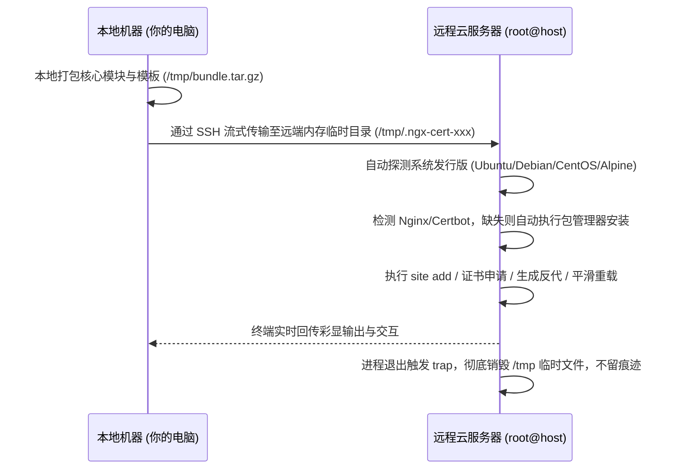

# ngx-cert-manager CLI 命令大全与场景使用指南 (CLI Reference)

本文档提供 `ngx-cert-manager`（短别名 `ngx-cert`）所有子命令的完整参数字典、核心技术原理与可直接复制的单行 CMD 命令示例。

> 💡 **内网穿透与泛域名实战专项手册**：若需要了解无公网 IP、FRP 单端口多域名复用、泛域名证书与后续添加子域名的完整实战指南，请参阅专门文档：[内网穿透与泛域名 SSL 反向代理完整运维指南](INTRANET_FRP_WILDCARD_GUIDE.md)。  
> 📚 **全场景部署与选型指南**：公网 VPS 直连、Cloudflare 小黄云、纯 DNS 直连等全场景选型决策树与详细命令，请参阅：[全场景实战与配置全集指南](FULL_SCENARIOS_GUIDE.md)。

---

## 目录
- [一、高频核心场景单行命令速查](#一高频核心场景单行命令速查)
- [二、什么是 Unix Domain Socket 反代 (示例 04 原理解析)](#二什么是-unix-domain-socket-反代-示例-04-原理解析)
- [三、远程机器免安装部署与依赖自动安装机制](#三远程机器免安装部署与依赖自动安装机制)
- [四、完整 CLI 子命令字典](#四完整-cli-子命令字典)
  - [1. 站点管理 (site)](#1-站点管理-site)
  - [2. 证书管理 (cert)](#2-证书管理-cert)
  - [3. Nginx 运维 (nginx)](#3-nginx-运维-nginx)
  - [4. 定时续期守护 (timer)](#4-定时续期守护-timer)
  - [5. 综合体检 (diagnose)](#5-综合体检-diagnose)
  - [6. 远程无痕代理 (--ssh / remote)](#6-远程无痕代理---ssh--remote)

---

## 一、高频核心场景单行命令速查

### 场景 1：Cloudflare 开启小黄云 (Proxied 边缘 SSL 代理)
> **说明**：Cloudflare 边缘节点提供 HTTPS 证书，源站无需申请证书，只监听 80 端口并将流量转发至本地 `3000` 端口。

```bash
sudo ngx-cert site add --domain cf.example.com --upstream 127.0.0.1:3000 --no-ssl
```

---

### 场景 2：Cloudflare 关闭小黄云 (纯 DNS 解析 / 直连源站)
> **说明**：流量直达源站，自动向 Let's Encrypt 申请 SSL 证书，配置 HTTPS 443 + HTTP 301 强跳 + HSTS + WebSocket，反代至 `3001` 端口。

```bash
sudo ngx-cert site add --domain app.example.com --upstream 127.0.0.1:3001 --email admin@example.com
```

---

### 场景 3：单台机器部署多个不同业务网站 (多租户隔离)
> **说明**：一台 VPS 同时托管官网（3000端口）、API平台（8080端口）和管理后台（9090端口），互不影响。

```bash
# 网站 1: 官网 (HTTPS)
sudo ngx-cert site add --domain www.example.com --upstream 127.0.0.1:3000 --email admin@example.com

# 网站 2: API 平台 (HTTPS + 100M 上传文件限制)
sudo ngx-cert site add --domain api.example.com --upstream 127.0.0.1:8080 --email admin@example.com --body-size 100m

# 网站 3: 后台 (Cloudflare 小黄云 HTTP 模式)
sudo ngx-cert site add --domain admin.example.com --upstream 127.0.0.1:9090 --no-ssl
```

---

### 场景 4：Unix Domain Socket (UDS) 高性能进程通信
> **说明**：后端是 Python Gunicorn/Uvicorn (FastAPI/Django) 或 PHP-FPM 时，使用本地套接字文件通信。

```bash
sudo ngx-cert site add --domain py.example.com --upstream unix:/run/gunicorn.sock: --email admin@example.com
```

---

### 场景 5：本地直接给远程服务器一键部署 (无需在远端提前装软件)
> **说明**：从你本地 Mac/Linux 笔记本直接控制远端服务器 `203.0.113.10`，远端如果没有安装 Nginx 或 Certbot，会**全自动检测并静默安装**，配置完成后自动销毁本地临时传输包。

```bash
# 远程配置标准 HTTPS 站点
./ngx-cert-manager --ssh root@203.0.113.10 site add --domain remote.example.com --upstream 127.0.0.1:8080 --email admin@example.com

# 远程查看站点列表
./ngx-cert-manager --ssh root@203.0.113.10 site list
```

---

### 场景 6：内网服务器 / 无公网 IP / FRP 穿透 (Cloudflare DNS-01 模式)
> **说明**：服务器处于内网无公网 IP，或通过 FRP 映射了自定义非标准公网端口。通过 Cloudflare DNS-01 API 验证，无需开放 80 端口，无需公网 IP，甚至支持申请泛域名证书 (`*.example.com`)。

```bash
# 方式 A：已在 config.env 中配置 CF_DNS_API_TOKEN (开箱即用)
sudo ngx-cert site add --domain api.example.com --upstream 127.0.0.1:10101 --email admin@example.com --dns-cf

# 方式 B：临时传入 Cloudflare API Token
sudo ngx-cert site add --domain api.example.com --upstream 127.0.0.1:10101 --email admin@example.com --dns-cf --cf-token "你的_Cloudflare_Token"

# 方式 C：只签发泛域名证书 (不配置反代)
sudo ngx-cert cert issue --domain "*.example.com" --email admin@example.com --dns-cf
```

---

### 场景 7：本地通过 SSH 私钥远程为内网/远端机器部署 (一键闭环)
> **说明**：通过 `--ssh` 和 `--ssh-key` 直接连接远端机器，本地 `config.env` 中的 Cloudflare Token 会自动安全打包并流式传输，在远端无痕执行，配置完成后自动销毁临时环境。

```bash
./ngx-cert-manager --ssh root@192.168.1.100 --ssh-key ~/ssh/sean site add \
    --domain app.example.com \
    --upstream 127.0.0.1:10101 \
    --email admin@example.com \
    --dns-cf
```

---

### 场景 8：反代无鉴权后端服务，在 Nginx 网关层强制 Bearer Token 鉴权
> **说明**：当反代本地无鉴权服务（例如本地 Ollama `127.0.0.1:11434`、Prometheus `9090`、内网 Python/Node 服务）时，通过 `--auth-bearer` 在 Nginx 网关层强制拦截未携带或错误 Bearer Token 的请求（响应 `401 Unauthorized`），自动放行跨域 `OPTIONS` 预检请求。若不指定 Token，系统会自动生成高强度 Token 并安全保存在 gitignored 的 `.tokens/` 目录中。

```bash
# 模式 A: 自动生成高强度 Token 并保存至 .tokens/ 目录 (受 .gitignore 保护)
sudo ngx-cert site add \
    --domain ai.example.com \
    --upstream 127.0.0.1:11434 \
    --email admin@example.com \
    --auth-bearer

# 模式 B: 自定义指定单 Token
sudo ngx-cert site add \
    --domain ai.example.com \
    --upstream 127.0.0.1:11434 \
    --email admin@example.com \
    --auth-bearer "sk-my-super-secret-token"

# 模式 C: 多 Token 保护 (英文逗号分隔)
sudo ngx-cert site add \
    --domain api.example.com \
    --upstream 127.0.0.1:8080 \
    --email admin@example.com \
    --auth-bearer "token_user1, token_user2"
```

---

### 场景 9：大语言模型 (LLM/AI) 专项反向代理 (`--optimize-llm`)
> **说明**：当反向代理本地或内网的大模型服务（例如 Ollama、vLLM、LocalAI、Open-WebUI、Text-Generation-WebUI 等 OpenAI 兼容后端）时，大模型在进行深度思考（Deep Thinking）或长文本生成时耗时长（可能耗时 1~10 分钟），且客户端通常需要使用 SSE（Server-Sent Events）逐字流式打字输出。若使用普通反代配置，极易发生 `504 Gateway Time-out` 或流式打字被 Nginx 缓冲区延迟截断。
>
> 启用 `--optimize-llm`（或简写 `--llm`）将自动应用深度优化配置：
> 1. **超长超时保障**：自动配置 `proxy_read_timeout 600s; proxy_send_timeout 600s;`（亦可通过 `--timeout <duration>` 自定义），杜绝长推理 504 错误。
> 2. **零缓冲实时流式**：配置 `proxy_buffering off; proxy_request_buffering off; proxy_cache off; chunked_transfer_encoding on;`，保障 SSE 逐 Token 秒级推送到前端打字机。
> 3. **低延迟网络加速**：开启 `tcp_nodelay on;`，同时向前端与下游代理下发 `X-Accel-Buffering no;`。
> 4. **大上下文与多模态**：自动提升请求体限制为 `client_max_body_size 100m;`。
> 5. **Lua 内存极速零思考直出**：若系统 Nginx 具备 Lua 模块支持（`lua_nginx_module`/OpenResty），会自动在 `proxy_pass` 前注入轻量内存拦截逻辑：当请求体未显式声明 `reasoning_effort` 且未开启 `"think": true` 时，自动给 JSON 补全 `"reasoning_effort": "none"`，让 Ollama 等后端模型直接以零思考极速输出首字（耗时 < 0.01ms），杜绝客户端未传参数时的卡顿等待。

```bash
# 模式 A: 纯 HTTP / Cloudflare Flexible 边缘代理 + Bearer 自动鉴权 + LLM 深度优化
sudo ngx-cert site add \
    --domain ai.example.com \
    --upstream 127.0.0.1:10001 \
    --no-ssl \
    --auth-bearer \
    --optimize-llm

# 模式 B: 完整 HTTPS + Let's Encrypt 证书 + 自定义超时 + Bearer 鉴权
sudo ngx-cert site add \
    --domain ai.example.com \
    --upstream 127.0.0.1:11434 \
    --email admin@example.com \
    --optimize-llm \
    --timeout 1200s \
    --auth-bearer
```

---

### 场景 10：根据域名动态更新、轮转或移除 Bearer Token (安全轮转与零中断热生效)
> **说明**：当密钥发生泄露、到达安全轮换周期，或者需要更换/移除 Bearer 鉴权时，系统完全基于域名（`--domain`）进行原子化管理。
>
> **核心机制**：
> 1. **全自动化修改**：自动解析该域名对应的 Nginx 配置文件，精确定位并热替换/剥离 Bearer 拦截规则，不破坏原站点的反代上游、SSL 或 LLM 优化参数。
> 2. **语法预检与平滑生效**：通过 `nginx -t` 语法沙箱预检后调用 `nginx -s reload`，实现**零停机热生效**。
> 3. **安全凭据自动同步**：自动更新或清理 `.tokens/<domain>.token`（`chmod 600`，已加入 `.gitignore`）。

```bash
# 模式 A: 自动生成并轮转全新高强度 Token (无需手动指定)
sudo ngx-cert site update-bearer --domain server-10001.002788.xyz
# 或使用顶层 token 命令:
sudo ngx-cert token update --domain server-10001.002788.xyz

# 模式 B: 更新为指定的自定义 Token (支持多个 Token，逗号分隔)
sudo ngx-cert site update-bearer --domain server-10001.002788.xyz --token "sk-new-super-secret-key"

# 模式 C: 查看当前域名配置的 Bearer Token 凭证
sudo ngx-cert token get --domain server-10001.002788.xyz

# 模式 D: 列出系统中所有反代站点配置的 Bearer Token
sudo ngx-cert token list

# 模式 E: 移除该域名的 Bearer 鉴权保护 (恢复透明代理)
sudo ngx-cert site update-bearer --domain server-10001.002788.xyz --remove
# 或:
sudo ngx-cert token delete --domain server-10001.002788.xyz
```

---

## 二、什么是 Unix Domain Socket 反代 (示例 04 原理解析)

在 Linux 环境下，当你的后端程序（如 Python FastAPI / Flask / Django、Node.js、PHP-FPM、Go）与 Nginx 运行在**同一台物理机/云服务器**上时，反向代理有两种通信方式：

```text
【传统 TCP 模式】:  
Nginx  <== (TCP 3次握手 / 本地回环 127.0.0.1:3000 / 端口占用) ==>  后端服务

【Unix Socket 模式】: 
Nginx  <== (Linux 内核内存管道 /run/app.sock / 零网络损耗) ==>  后端服务
```

### 为什么推荐使用 Unix Domain Socket？
1. **性能更高（吞吐提升 15%~30%）**：
   - 绕过了整个 TCP/IP 协议栈（无需 TCP 建立连接、无需计算校验和、无需经过本地回环虚拟网卡），直接通过 Linux 内存文件描述符传输，延迟极低。
2. **避免端口耗尽与端口冲突**：
   - 不需要占用系统的 TCP 端口号（如 3000、8080 等），在高并发连接下不会出现 `TIME_WAIT` 端口枯竭问题。
3. **安全性更高**：
   - Socket 只是一个内部文件（如 `/run/app.sock`），外部黑客或扫描器无法通过端口扫描发现你的后端服务，且可以通过 Linux 文件权限（`chmod 660`）严格控制访问者。

---

## 三、远程机器免安装部署与依赖自动安装机制

当你执行 `--ssh root@remote-ip ...` 命令在远程机器上添加站点时：

### 1. 会自动判断并安装缺失的软件吗？
**是的，完全自动检测、自动安装！**
- **Nginx 自动安装**：当执行 `site add` 时，套件会首先检查远程机器是否有 `nginx` 二进制。如果未安装，会自动调用底层包管理器（Ubuntu/Debian 调 `apt`，CentOS/RHEL/Rocky/Alma 调 `dnf/yum`，Alpine 调 `apk`，Arch 调 `pacman`）自动完成 Nginx 安装并启动。
- **Certbot 自动安装**：当申请 SSL 证书时，如果远程机器没有 `certbot`，会自动安装 `certbot` 及其 Nginx 插件。
- **依赖自愈**：包括 `000-default-acme.conf` 穿透规则、`000-websocket-map.conf` 映射、`/var/www/certbot` 目录等均会自动初始化就绪。

### 2. 远程无痕架构工作流


---

## 四、完整 CLI 子命令字典

### 1. 站点管理 (`site`)

| 命令 | 参数说明 | 作用描述 |
| :--- | :--- | :--- |
| `ngx-cert site add` | `--domain <域名>` *(必填)*<br>`--upstream <后端地址>` *(必填)*<br>`--email <邮箱>` *(申请证书时推荐)*<br>`--auth-bearer <token>` *(可选: 为无鉴权后端添加 Bearer 鉴权)*<br>`--https-port <端口>` *(可选内部 HTTPS 监听端口)*<br>`--dns-cf` *(启用 Cloudflare DNS-01 验证)*<br>`--cf-token <token>` *(指定 Cloudflare API Token)*<br>`--no-ssl` 或 `--http-only` *(开启纯 HTTP 反代)*<br>`--hsts` / `--no-hsts` *(开启/关闭 HSTS)*<br>`--ws` / `--no-ws` *(开启/关闭 WebSocket)*<br>`--body-size <大小>` *(上传限制，默认 50m)*<br>`--staging` *(沙箱演练测试证书)*<br>`--skip-dns-check` *(跳过 DNS 校验)* | 一键完成域名检验、证书申请、安全配置生成与平滑生效 |
| `ngx-cert site list` | 无 | 查看当前服务器上所有受管站点的大盘与状态 |
| `ngx-cert site get` | `--domain <域名>` | 打印查看指定站点的实际 Nginx 配置文件内容 |
| `ngx-cert site update-bearer` | `--domain <域名>` *(必填)*<br>`--token <新Token>` *(可选指定)*<br>`--remove` *(可选移除鉴权)* | 根据域名原子更新、轮转或移除 Bearer Token 鉴权 |
| `ngx-cert site delete` | `--domain <域名>`<br>`--delete-cert` *(可选同时吊销证书)* | 安全归档并移除站点配置，平滑重载 Nginx |

---

### 2. 证书管理 (`cert`)

| 命令 | 参数说明 | 作用描述 |
| :--- | :--- | :--- |
| `ngx-cert cert issue` | `--domain <域名>` *(必填)*<br>`--email <邮箱>` *(必填)*<br>`--webroot` *(默认 Webroot 零停机)*<br>`--standalone` *(独立端口模式)*<br>`--dns-cf` *(Cloudflare DNS-01 API 验证模式)*<br>`--cf-token <token>` *(指定 Cloudflare API Token)*<br>`--staging` *(沙箱环境)*<br>`--force` *(强制重新申请)* | 独立申请 Let's Encrypt 免费 SSL 证书 (支持泛域名) |
| `ngx-cert cert list` | 无 | 证书监控大盘，查看全部证书到期日及 🟢/🟡/🔴 三级预警 |
| `ngx-cert cert renew` | `--force` *(强制续期)*<br>`--dry-run` *(模拟演练不消耗限额)* | 扫描所有证书并执行自动化续期 |
| `ngx-cert cert revoke` | `--domain <域名>` | 吊销并清理对应域名的证书文件 |

---

### 3. Nginx 运维 (`nginx`)

| 命令 | 作用描述 |
| :--- | :--- |
| `ngx-cert nginx status` | 查看 Nginx 安装状态、版本号及当前运行状态 |
| `ngx-cert nginx test` | 执行严格的 Nginx 配置文件语法自检 (`nginx -t`) |
| `ngx-cert nginx reload` | 语法自检通过后平滑重载服务 (`systemctl reload` / `nginx -s reload`) |
| `ngx-cert nginx start` / `stop` / `restart` | 控制 Nginx 进程启动、停止与重启 |
| `ngx-cert nginx bootstrap` | 初始化全局 ACME Webroot 穿透与 WebSocket Map 基础规则 |

---

### 4. 定时续期守护 (`timer`)

| 命令 | 作用描述 |
| :--- | :--- |
| `ngx-cert timer setup` | 自动注册并激活 Systemd Timer (带 3600s 随机抖动) 或 Cron 守护任务 |
| `ngx-cert timer status` | 查看定时器运行状态及下一次自动触发时间 |
| `ngx-cert timer trigger` | 立即手动触发一次 Oneshot 续期守护测试 |
| `ngx-cert timer logs` | 查看证书自动续期的系统审计日志 |

---

### 5. 综合体检 (`diagnose`)

```bash
sudo ngx-cert diagnose
```
- **检测项包括**：
  1. 系统发行版、内核架构、Init 守护系统探测。
  2. IPv6 支持探测（是否需要防崩溃剔除 `[::]` 监听）。
  3. 公网 IPv4 / IPv6 多源接口嗅探。
  4. 80 / 443 端口占用与冲突进程（Apache / Caddy 等）分析与自愈。
  5. Nginx 服务健康度与配置语法自检。
  6. 定时续期守护运行状态。

---

### 6. 远程无痕代理 (`--ssh` / `remote`)

```bash
# 格式:
ngx-cert-manager --ssh <用户@服务器IP[:端口]> <子命令> [参数...]

# 常用示例:
ngx-cert-manager --ssh root@1.2.3.4 site list
ngx-cert-manager --ssh root@1.2.3.4 site add --domain api.example.com --upstream 127.0.0.1:8080 --email admin@example.com
ngx-cert-manager --ssh root@1.2.3.4:2222 diagnose
```

---

### 7. Bearer Token 凭据管理 (`token`)

| 命令 | 参数说明 | 作用描述 |
| :--- | :--- | :--- |
| `ngx-cert token update` | `--domain <域名>` *(必填)*<br>`--token <新Token>` *(可选)*<br>`--remove` *(可选)* | 根据域名原子轮转/更新 Bearer 密钥，或移除鉴权 |
| `ngx-cert token get` | `--domain <域名>` *(必填)* | 查看指定域名当前生效的 Bearer Token 凭证 |
| `ngx-cert token list` | 无 | 列表大盘展示所有反向代理站点的 Bearer Token 与凭据文件 |
| `ngx-cert token delete` | `--domain <域名>` *(必填)* | 移除指定域名的 Bearer 鉴权并清理 `.tokens/` 凭据文件 |

